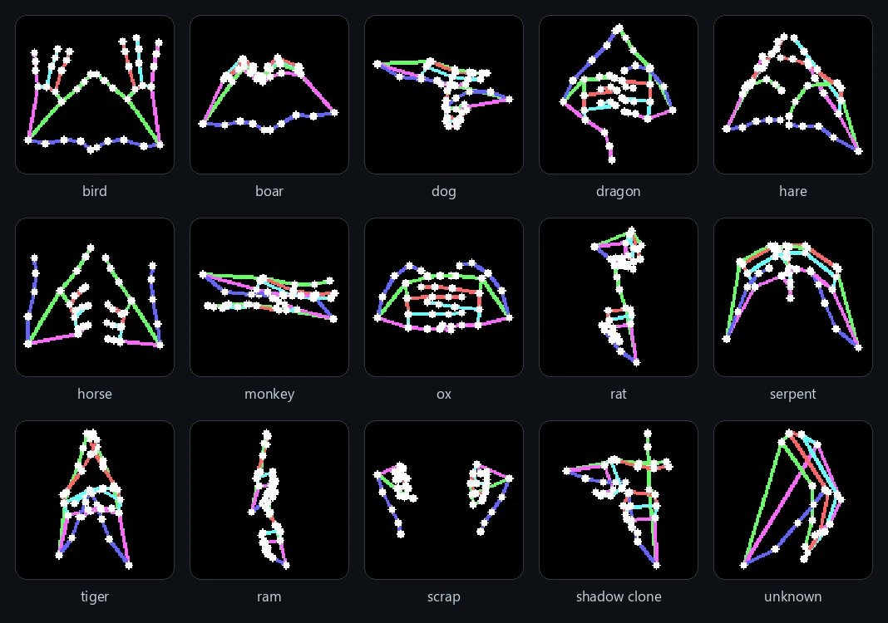
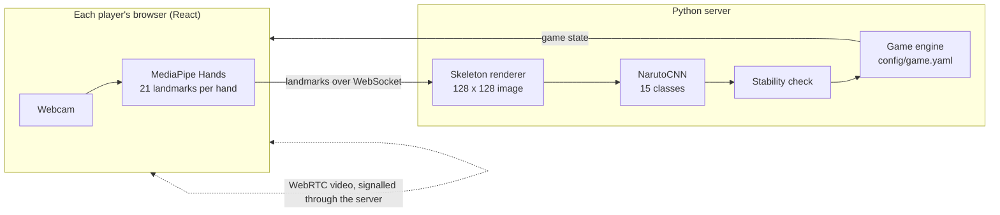
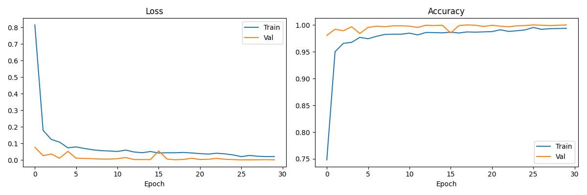

<div align="center">

# Shinobi Battle

A two-player, turn-based battle game where you cast jutsu by performing real hand signs in front of your webcam.<br>
A computer vision pipeline reads the signs, a Python server runs the battle, and the players see each other over WebRTC.

[![Python][badge-python]][link-python]
[![PyTorch][badge-pytorch]][link-pytorch]
[![MediaPipe][badge-mediapipe]][link-mediapipe]
[![React][badge-react]][link-react]
[![Vite][badge-vite]][link-vite]
[![WebSockets][badge-ws]][link-ws]
[![WebRTC][badge-webrtc]][link-webrtc]
[![License: MIT][badge-license]](LICENSE)



<sub>What the CNN sees: one sample from each of the 15 classes, rendered from MediaPipe hand landmarks.</sub>

</div>

## About

Shinobi Battle is a game inspired by Naruto and by old turn-based Pokemon battles. There is no move menu: to cast a jutsu you chain two-handed hand signs (tiger, serpent, dragon and so on) and then perform the Ram sign to release them. A custom CNN, trained from scratch on a dataset I collected, recognises the signs in real time, and the server turns each recognised sequence into damage, healing, buffs and debuffs.

Two players join a room from their browsers. The game state lives on a Python WebSocket server, the webcam video goes peer to peer over WebRTC, and the whole thing can be shared over the internet with a Cloudflare tunnel.

## How it works



1. MediaPipe Hands runs in each player's browser and sends the hand landmarks to the server, so no video frames are uploaded.
2. The server draws the landmarks as a 128 x 128 skeleton image with colour-coded fingers. Working on skeletons rather than camera images keeps the model largely independent of lighting, skin tone and background.
3. A small CNN classifies the skeleton into one of 15 classes: 11 jutsu signs, Ram (activate), Scrap (clear the buffer), Shadow Clone and Unknown.
4. A sign only counts once the player holds it for 0.8 seconds at 75% confidence or higher, which stops half-formed signs and transitions between signs from firing. The standalone OpenCV tool in `cv/inference.py` uses the same idea with a 5-frame, 70% rule from `config/game.yaml`.
5. The game engine is authoritative. It keeps each player's sign buffer, resolves jutsu, applies miss rates, cooldowns, buffs and debuffs, and pushes the new state to both clients.

## The model

| | |
|---|---|
| Dataset | 8,735 skeleton images across 15 classes (514 to 704 per class), captured with `cv/data_collector.py` |
| Architecture | Three convolution blocks (32, 64, 128 filters, each with batch norm, ReLU and max pooling), adaptive average pooling, dropout 0.3, then two fully connected layers |
| Size | 225,807 parameters |
| Augmentation | Random rotation up to 15 degrees, horizontal flip, brightness and contrast jitter, 10% translation |
| Training | Adam (learning rate 0.001, weight decay 0.0001), learning rate halved when validation loss stalls for 5 epochs, 30 epochs, batch size 32, 80/20 random split |
| Result | About 99% validation accuracy |

<p align="center">
  
</p>

## Gameplay

- Turns alternate, and only the active player can act.
- Signs go into a private buffer of up to six signs that only you can see.
- Ram releases the buffer. If the sequence matches a jutsu it fires; if not, you lose chakra (5 plus 2 per sign).
- Scrap clears the buffer without ending your turn.
- Shadow Clone is instant and skips the buffer. It costs half your chakra and adds 50% to the miss chance of the enemy's next attack, with a 3-turn cooldown.
- Ram with an empty buffer is Focus, which gives 20 extra chakra.
- Every player regains 10 chakra at the end of each turn and starts with 100 HP and 100 chakra.
- Each player can hold up to two buffs and two debuffs at once.

### Jutsu

| Jutsu | Signs | Type | Damage | Chakra | Miss | Effect | Cooldown |
|---|---|---|---|---|---|---|---|
| Wind Scythe | Bird, Tiger | Attack | 20 | 15 | 10% | | 1 |
| Mud Wall | Dog, Boar | Defense | | 10 | 5% | Earth Shield: 5 less damage taken for 2 turns | 2 |
| Phoenix Flower | Rat, Tiger, Serpent | Attack | 18 | 30 | 15% | Burn: 3 damage per turn for 2 turns, drains 5 enemy chakra | 2 |
| Healing Palm | Boar, Horse, Dog | Heal | Heals 15 | 30 | 5% | Regen: 3 HP per turn for 2 turns | 3 |
| Water Dragon | Ox, Monkey, Hare, Rat | Attack | 28 | 30 | 20% | Soak: enemy takes 5 more damage per hit for 2 turns | 3 |
| Genjutsu Bind | Serpent, Rat, Bird, Ox | Debuff | 8 | 15 | 20% | Confusion: enemy miss rate +20% for 2 turns, drains 10 enemy chakra | 3 |
| Fire Dragon Bomb | Serpent, Dragon, Hare, Tiger, Dog | Attack | 35 (5 to self) | 35 | 25% | Burn: 4 damage per turn for 2 turns | 4 |
| Chakra Armor | Ox, Boar, Horse, Monkey, Tiger | Defense | | 25 | 5% | 8 less damage taken for 3 turns | 4 |
| Grand Fireball | Serpent, Monkey, Boar, Horse, Tiger, Bird | Attack | 45 (10 to self) | 45 | 30% | | 5 |
| Forbidden Seal | Dragon, Rat, Ox, Serpent, Bird, Hare | Debuff | 15 (10 to self) | 40 | 25% | Sealed: enemy loses 8 chakra per turn for 3 turns, drains 20 enemy chakra | 5 |
| Chidori | Ox, Horse, Hare, Horse, Serpent, Monkey | Attack | 45 (5 to self) | 30 | 10% | | 3 |
| Rasengan | Dog, Dragon, Tiger, Monkey, Boar, Dog | Attack | 45 (5 to self) | 30 | 20% | | 3 |

`config/game.yaml` also contains Slap, a single-sign (Horse) move that deals 100 damage and is there for testing. `Forbidden-Secret-Scroll.pdf` is an illustrated guide to the jutsu.

## Quick start

### 1. Install dependencies

```bash
# Backend
cd server && pip install -r requirements.txt

# CV pipeline
cd cv && pip install -r requirements.txt

# Frontend
cd client && npm install
```

### 2. Collect training data (optional)

The trained weights are already in `models/naruto_cnn.pth`. To build your own dataset:

```bash
cd cv
python data_collector.py
```

- Use the number keys (0 to 9) and letters (a to e) to pick a class
- Press space to capture frames, or `s` to auto-save
- Aim for 100 to 200 samples per class

### 3. Train the CNN (optional)

```bash
cd cv
python train.py --data ../data --epochs 30
```

### 4. Start the server

```bash
cd server
python main.py          # WebSocket server on port 8765
```

### 5. Start the frontend

```bash
cd client
npm run dev
```

### 6. Play

1. Open http://localhost:5173 in two browser tabs (or on two machines).
2. Enter names and join the same room.
3. Complete the calibration screen, which shows the sign the model currently detects.
4. Battle.

### Playing over the internet

Expose the frontend with Cloudflare (or ngrok) and share the link:

```bash
cloudflared tunnel --url http://localhost:5173
```

## Configuration

Every balance value lives in `config/game.yaml`: jutsu damage, chakra costs, miss rates and cooldowns, buff and debuff effects and durations, passive regeneration, the Focus bonus, failure penalties, the buffer length and the buff and debuff limits. The server checks at startup that every required setting and every jutsu field is present.

## Project layout

```
├── config/game.yaml          Balance values and jutsu definitions
├── server/                   Python WebSocket server (authoritative game state)
│   ├── main.py               Entry point, rooms, message routing, WebRTC signalling relay
│   ├── inference_worker.py   Skeleton rendering, CNN inference and the hold-to-confirm check
│   ├── game_engine.py        Turn logic, jutsu resolution, buffs and debuffs
│   ├── game_state.py         State models
│   ├── config_loader.py      YAML config reader
│   └── message_types.py      Message protocol
├── cv/                       Computer vision pipeline
│   ├── landmark_extractor.py MediaPipe hand detection
│   ├── skeleton_renderer.py  128 x 128 skeleton image renderer
│   ├── model.py              NarutoCNN (15 classes)
│   ├── inference.py          Standalone real-time inference with stability check
│   ├── data_collector.py     Training data capture tool
│   └── train.py              Training script
├── client/                   React + Vite frontend
│   └── src/
│       ├── App.jsx           Lobby, calibration and battle screens
│       ├── hooks/            WebSocket, WebRTC, MediaPipe and game state hooks
│       └── components/       UI components
├── models/                   Trained weights, MediaPipe hand model, training curves
├── docs/images/              Images used in this README
└── data/                     Training data (gitignored)
```

## Limitations

- The training and validation images come from the same capture sessions and were split at random, so near-identical frames can end up on both sides. The 99% validation accuracy is an upper bound; accuracy on new players, hands and camera angles will be lower.
- Every sign is two-handed, so both hands need to be in frame for MediaPipe to return all 42 landmarks.
- The server keeps rooms in memory and does not handle reconnects, so a dropped connection ends the match.

## License

Code released under the [MIT License](LICENSE). Naruto and its jutsu names belong to Masashi Kishimoto and Shueisha; this is a non-commercial fan project, and the sound files in `client/public/sounds` remain the property of their owners.

## Author

Made by Rudra Somaiya.

[![GitHub][badge-github]][link-github]
[![LinkedIn][badge-linkedin]][link-linkedin]

[badge-python]: https://img.shields.io/badge/Python-3776AB?style=for-the-badge&logo=python&logoColor=white
[badge-pytorch]: https://img.shields.io/badge/PyTorch-EE4C2C?style=for-the-badge&logo=pytorch&logoColor=white
[badge-mediapipe]: https://img.shields.io/badge/MediaPipe-0097A7?style=for-the-badge&logo=mediapipe&logoColor=white
[badge-react]: https://img.shields.io/badge/React-19-20232A?style=for-the-badge&logo=react&logoColor=61DAFB
[badge-vite]: https://img.shields.io/badge/Vite-646CFF?style=for-the-badge&logo=vite&logoColor=white
[badge-ws]: https://img.shields.io/badge/WebSockets-010101?style=for-the-badge&logo=socketdotio&logoColor=white
[badge-webrtc]: https://img.shields.io/badge/WebRTC-333333?style=for-the-badge&logo=webrtc&logoColor=white
[badge-license]: https://img.shields.io/badge/License-MIT-F7DF1E?style=for-the-badge
[badge-github]: https://img.shields.io/badge/GitHub-RudraSomaiya-181717?style=for-the-badge&logo=github&logoColor=white
[badge-linkedin]: https://img.shields.io/badge/LinkedIn-Rudra_Somaiya-0A66C2?style=for-the-badge&logo=data:image/svg%2bxml;base64,PHN2ZyB4bWxucz0iaHR0cDovL3d3dy53My5vcmcvMjAwMC9zdmciIHZpZXdCb3g9IjAgMCAyNCAyNCI+PHBhdGggZmlsbD0iI2ZmZiIgZD0iTTIwLjQ1IDIwLjQ1aC0zLjU2di01LjU3YzAtMS4zMy0uMDItMy4wNC0xLjg1LTMuMDQtMS44NSAwLTIuMTQgMS40NS0yLjE0IDIuOTR2NS42N0g5LjM1VjloMy40MXYxLjU2aC4wNWMuNDgtLjkgMS42NC0xLjg1IDMuMzctMS44NSAzLjYgMCA0LjI3IDIuMzcgNC4yNyA1LjQ2djYuMjh6TTUuMzQgNy40M2EyLjA2IDIuMDYgMCAxIDEgMC00LjEyIDIuMDYgMi4wNiAwIDAgMSAwIDQuMTJ6TTcuMTIgMjAuNDVIMy41NlY5aDMuNTZ2MTEuNDV6TTIyLjIyIDBIMS43N0MuNzkgMCAwIC43NyAwIDEuNzN2MjAuNTRDMCAyMy4yMy43OSAyNCAxLjc3IDI0aDIwLjQ1Yy45OCAwIDEuNzgtLjc3IDEuNzgtMS43M1YxLjczQzI0IC43NyAyMy4yIDAgMjIuMjIgMHoiLz48L3N2Zz4=
[link-python]: https://www.python.org
[link-pytorch]: https://pytorch.org
[link-mediapipe]: https://ai.google.dev/edge/mediapipe/solutions/vision/hand_landmarker
[link-react]: https://react.dev
[link-vite]: https://vite.dev
[link-ws]: https://websockets.readthedocs.io
[link-webrtc]: https://webrtc.org
[link-github]: https://github.com/RudraSomaiya
[link-linkedin]: https://www.linkedin.com/in/rudra-somaiya/
